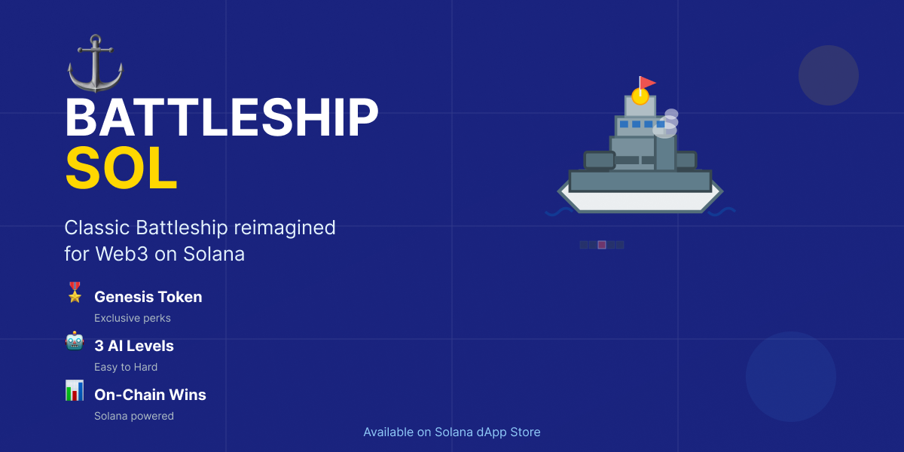

# ⚓ Battleship Sol

Classic Battleship game reimagined for Web3 on Solana blockchain.

## 🎮 Features

- **Classic Gameplay** - Traditional Battleship naval strategy
- **3 AI Difficulty Levels** - Easy, Medium, and Hard opponents
- **🎖️ Genesis Token Integration** - Exclusive perks for Seeker Genesis holders
- **📊 On-Chain Victories** - Your wins recorded on Solana blockchain
- **⚓ Ship Customization** - Manual placement, presets (Defense, Attack, Balance, Chaos), or random
- **💎 Optional Donation** - Support development with 0.001 SOL

## 🔐 Genesis Token Benefits

Exclusive features for Solana Seeker Genesis Token holders:
- 🎖️ Exclusive badge display
- 🤖 Hard AI difficulty unlocked
- 📊 On-chain victory recording
- 🎨 Seeker-themed UI elements

## 🛠️ Tech Stack

- **Kotlin** - Primary language
- **Jetpack Compose** - Modern Android UI
- **Mobile Wallet Adapter (MWA) 2.0.3** - Secure wallet integration
- **Solana Mainnet-beta** - Blockchain network
- **Memo Program** - On-chain data storage

## 📱 Download

Available on [Solana dApp Store](https://dapp-store.solanamobile.com) for Solana Seeker devices.

## 🎯 How to Play

1. **Connect Wallet** - Use your Solana wallet via Mobile Wallet Adapter
2. **Customize Ships** - Choose preset strategy or place manually
3. **Battle AI** - Select difficulty and engage in naval combat
4. **Track Victories** - View your on-chain win history

## 🏗️ Development

### Requirements
- Android Studio Hedgehog or later
- Kotlin 1.9+
- Solana Seeker device (or Android emulator)

### Treasury
Donations support: `HPnjsL4nFyxF3E82REjb24BxMiw1UsD3rpdm4mUJ5jVV`

## 📄 Legal

- [Privacy Policy](./PRIVACY.md)
- [MIT License](./LICENSE)

## 🤝 Contributing

Built by Egor for the Solana Mobile ecosystem.

## 📞 Support

For issues or questions: formeee89@gmail.com

---

⚓ **Battleship Sol** - Classic naval strategy meets Web3
